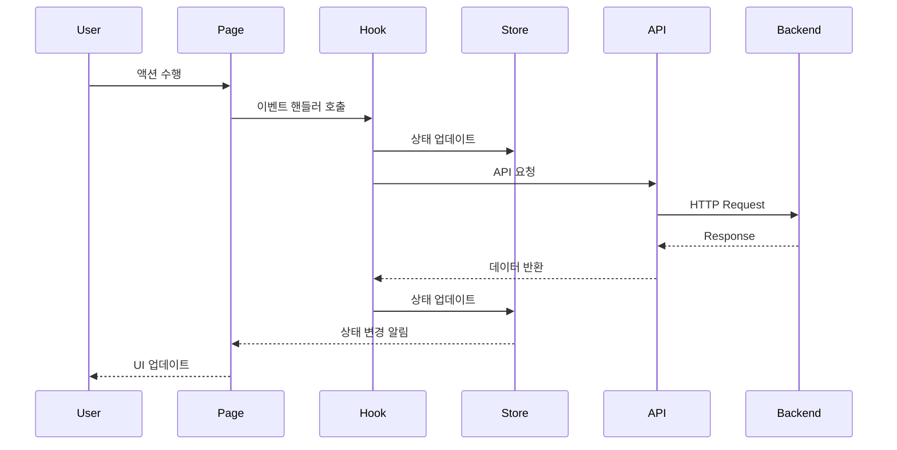
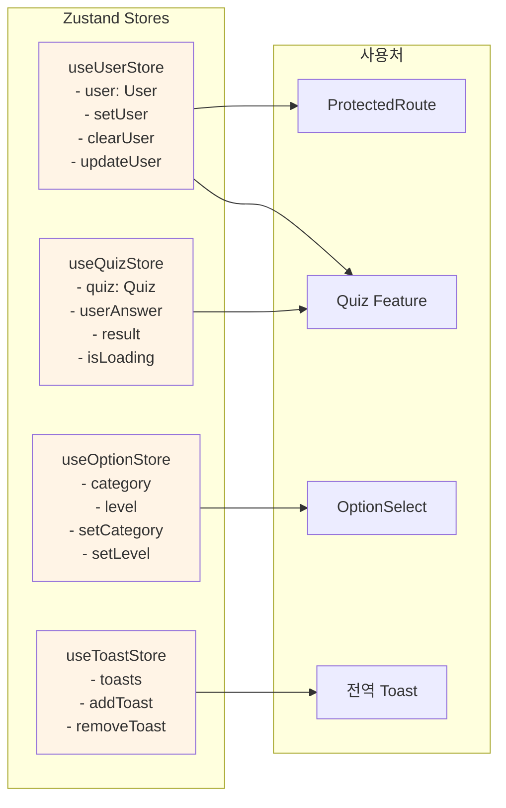
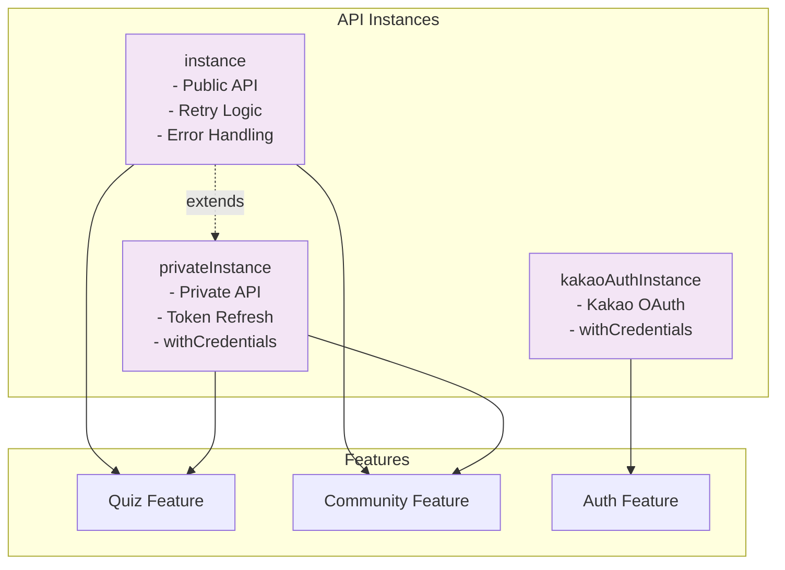
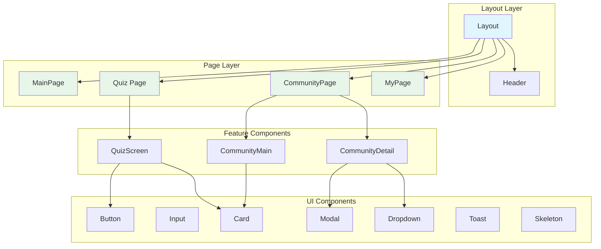
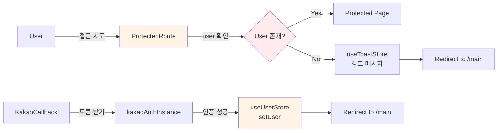
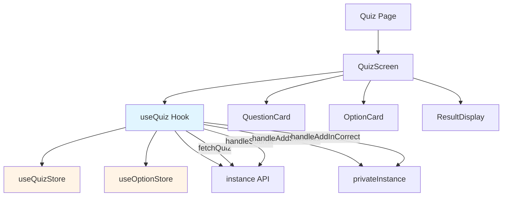
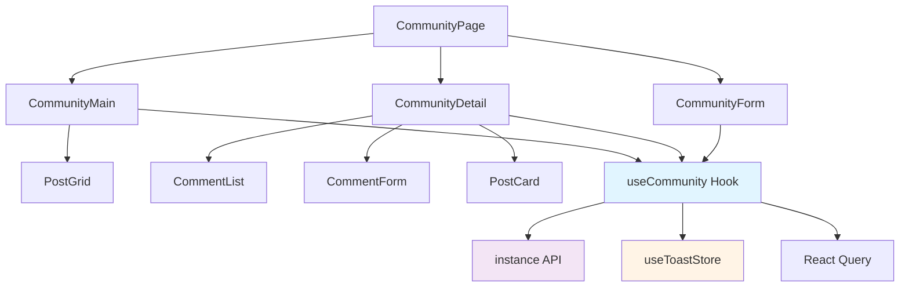
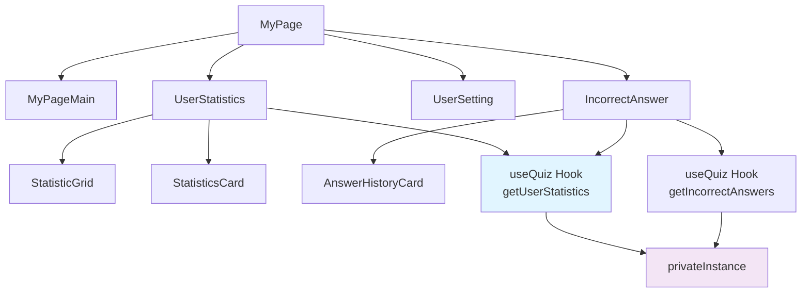
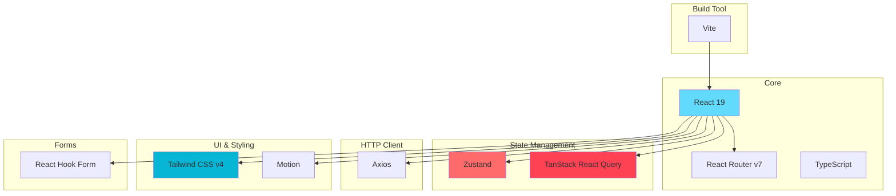

# Front-Quiz 아키텍처 다이어그램

  

## 전체 시스템 구조

```mermaid

graph TB

    subgraph "Entry Point"

        main[main.tsx]

        App[App.tsx]

    end

  

    subgraph "Routing Layer"

        Router[React Router]

        Layout[Layout Component]

        ProtectedRoute[ProtectedRoute]

    end

  

    subgraph "Pages"

        LandingPage[LandingPage]

        MainPage[MainPage]

        OptionSelect[OptionSelect]

        Quiz[Quiz Page]

        CommunityPage[CommunityPage]

        MyPage[MyPage]

        KakaoCallback[KakaoCallback]

        NotFound[NotFound]

    end

  

    subgraph "Features"

        subgraph "Quiz Feature"

            QuizScreen[QuizScreen]

            QuestionCard[QuestionCard]

            OptionCard[OptionCard]

            ResultDisplay[ResultDisplay]

            useQuiz[useQuiz Hook]

        end

        subgraph "Community Feature"

            CommunityMain[CommunityMain]

            CommunityDetail[CommunityDetail]

            CommunityForm[CommunityForm]

            PostGrid[PostGrid]

            CommentList[CommentList]

            CommentForm[CommentForm]

            useCommunity[useCommunity Hook]

        end

        subgraph "MyPage Feature"

            MyPageMain[MyPageMain]

            UserStatistics[UserStatistics]

            UserSetting[UserSetting]

            IncorrectAnswer[IncorrectAnswer]

        end

    end

  

    subgraph "State Management"

        useUserStore[useUserStore<br/>User State]

        useQuizStore[useQuizStore<br/>Quiz State]

        useOptionStore[useOptionStore<br/>Option State]

        useToastStore[useToastStore<br/>Toast State]

    end

  

    subgraph "API Layer"

        instance[instance<br/>Public API]

        privateInstance[privateInstance<br/>Private API]

        kakaoAuthInstance[kakaoAuthInstance<br/>Kakao Auth]

    end

  

    subgraph "Components"

        Header[Header]

        Button[Button]

        Input[Input]

        Card[Card]

        Modal[Modal Components]

        Dropdown[Dropdown Components]

        Toast[Toast Components]

        Skeleton[Skeleton Components]

        ErrorBoundary[ErrorBoundary]

    end

  

    subgraph "Contexts"

        ModalContext[ModalContext]

        DropdownContext[DropdownContext]

    end

  

    subgraph "Hooks"

        useCheckIsLogin[useCheckIsLogin]

        useLogout[useLogout]

        useDebounce[useDebounce]

        useInfiniteScroll[useInfiniteScroll]

        useSearch[useSearch]

        useScroll[useScroll]

        useUploadImage[useUploadImage]

    end

  

    subgraph "Utils & Constants"

        Utils[Utils<br/>formatDate, cn, etc]

        Constants[Constants<br/>apiConstants, categoryList, etc]

        Types[Types<br/>Type Definitions]

    end

  

    main --> App

    App --> Router

    Router --> Layout

    Router --> LandingPage

    Router --> KakaoCallback

    Router --> NotFound

    Layout --> ProtectedRoute

    Layout --> Header

    Router --> MainPage

    Router --> OptionSelect

    Router --> Quiz

    Router --> CommunityPage

    Router --> MyPage

    ProtectedRoute --> MyPage

    Quiz --> QuizScreen

    QuizScreen --> QuestionCard

    QuizScreen --> OptionCard

    QuizScreen --> ResultDisplay

    QuizScreen --> useQuiz

    CommunityPage --> CommunityMain

    CommunityPage --> CommunityDetail

    CommunityPage --> CommunityForm

    CommunityMain --> PostGrid

    CommunityDetail --> CommentList

    CommunityDetail --> CommentForm

    CommunityDetail --> useCommunity

    MyPage --> MyPageMain

    MyPage --> UserStatistics

    MyPage --> UserSetting

    MyPage --> IncorrectAnswer

    useQuiz --> useQuizStore

    useQuiz --> useOptionStore

    useQuiz --> useUserStore

    useQuiz --> instance

    useQuiz --> privateInstance

    useCommunity --> instance

    useCommunity --> useToastStore

    ProtectedRoute --> useUserStore

    ProtectedRoute --> useToastStore

    Modal --> ModalContext

    Dropdown --> DropdownContext

    instance --> Constants

    privateInstance --> instance

    privateInstance --> useUserStore

    style main fill:#e1f5ff

    style App fill:#e1f5ff

    style useUserStore fill:#fff4e6

    style useQuizStore fill:#fff4e6

    style useOptionStore fill:#fff4e6

    style useToastStore fill:#fff4e6

    style instance fill:#f3e5f5

    style privateInstance fill:#f3e5f5

    style kakaoAuthInstance fill:#f3e5f5

```

  

  

## 데이터 흐름도

  

  

## 상태 관리 구조

  

  

## API 인스턴스 구조

  

  

## 컴포넌트 계층 구조

  

  

## 인증 및 보호된 라우트

  

  

## 주요 기능별 상세 구조

  

### Quiz Feature

  

### Community Feature

  

### MyPage Feature

  

## 기술 스택 및 의존성

  

